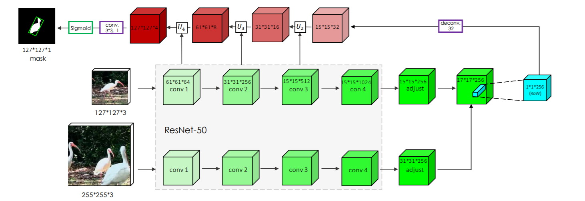

# Seguimiento de objetos con Siam Mask

**SiamMask** es una arquitectura de modelo de deep learning que realiza el seguimiento visual de objetos (VOT) y la segmentación semisupervisada de objeto en vídeos (VOS). Dada la ubicación del objeto en el primer frame de la secuencia, el objetivo de **VOT** es **estimar la posición de un objeto en los sisguientes frames** con la mayor precisión posible. De la misma forma, el objetivo principal de **VOS** es obtener una **máscara de segmentación binaria que exprese si un píxel pertenece o no al objetivo**. 

## Arquitectura SiamMask
SiamMask es una red siamesa que añade una nueva rama para producir una máscara binaria a nivel de píxel. 


> Hay dos variantes, con dos y con tres ramas.

* **Backbone** en SiamMask es el ResNet-50. La arquitectura representada a continuación utiliza las 4 primeras etapas de ResNet, la capa de ajuste y la correlación cruzada en profundidad, lo que da como resultado un mapa de características de tamaño 17×17.
* **Network heads**: bloque conv5 de la arquitectura contiene una capa de normalización y una capa de activación no lineal ReLU, mientras que conv6 sólo consta de una capa convolucional 1×1.
* **Refinement**: módulo que fusiona características de baja y alta resolución utilizndo múltiples pasos de refinamiento que hacen uso de capas de muestreo ascendente y conexiones de salto.



## Implementación en arcgis.learn

```python
# Cargar clase del módulo
from arcgis.learn import SiamMask

# Iniciar SiamMask. Hay dos formas:
## Con pesos pre-entrenados DAVIS (sin pasar parámetros)
ot = SiamMask()

## Entrenar modelo con datos propios con el método prepare_data
from arcgis.learn import prepare_data
data = prepare_data(r"path_to_data_folder", dataset_type="ObjectTracking", batch_size=64)
ot = SiamMask(data)

# Inicializar el objeto

## Inicializar objetos utilizando bounding box. Los parámetros que usamos son:
## * frame: array de numpy donde se inicialia el seguimiento del objeto
## * detections: lista de cajas delimitadoras para inicializar el objeto como [[x,y,w,h]] = x-coordinate, y-coordinate, width of bbox, height of bbox
## * labels: lista de etiquetas que representa la clase del objeto
## * reset: booleano que podemos poner a True si queremos resetear de los valores del seguimiento anterior
tracks = ot.init(img, [[x,y,w,h]], [['truck']])


# Actualizar la localización del objeto en los siguientes frames

## Se pasa como parámetro el frame, el array de numpy para actualizar la posición del objeto
state = ot.update(frame)
```

### Ejemplo de implementación
Si ejecutas este código hay que tener en cuenta que:
- Al lanzar la celda que inicializa el análisis del vídeo
- Hay que pulsar el **espacio** para parar el vídeo
- Con el ratón seleccionar el elemento a analizar
- Volver a pulsar el espacio para empezar a trackear el objeto
- Podemos salir pulsando **q**

```python
import numpy as np
import cv2
from arcgis.learn import SiamMask

ot = SiamMask() # O cargar modelo concreto con SiamMask.from_model("path_to_save_model")

cap = cv2.VideoCapture(r"path_to_video_file")

# Aquí se empieza a analizar el vídeo
initialized = False
while(True):
    ret, frame = cap.read()
    if ret is False:
        break
    if initialized:
        state = ot.update(frame)  ## Update the track location in the frame
        for track in state:
            mask = track.mask
            frame[:, :, 2] = (mask > 0) * 255 + (mask == 0) * frame[:, :, 2]
            cv2.polylines(frame, [np.int0(track.location).reshape((-1, 1, 2))], True, (w, 255, h), 1)
            
    cv2.imshow('frame',frame)
    key = cv2.waitKey(1)
    if key & 0xFF == ord('q'):
        break
    
    if key == 32:
        init_rect = cv2.selectROI('frame', frame, False, False)
        values = np.array(init_rect)
        if all(values == 0):
            continue
        x, y, w, h = init_rect
        state = ot.init(frame, [[x,y,w,h]]) ## Initialize the track in the frame
        initialized = True
        cv2.waitKey()

cap.release()
cv2.destroyAllWindows()
```

Ejemplo:
