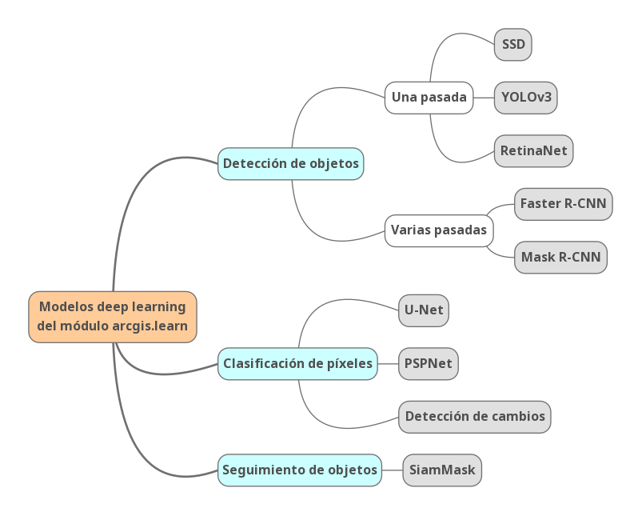

# API for Python + deep learning = arcgis.learn
En el módulo de *arcgis.learn* de la API de ArcGIS for Python podemos encontrar herramientas y funcionalidades para aplicar técnica de aprendizaje automático y profundo a datos espaciales de la plataforma ArcGIS. Algunas de las funcionalidades principales son la detección de objetos, la clasificación de imágenes, segmentación semántica o clasificación de datos ráster. 

## [Conceptos básicos](./dummies/basic.md)
Antes de analizar y probar los modelos de deep learning, creo que es interesante tener claros los conceptos básicos del deep learning:

## Modelos de deep learning en ArcGIS
Hay muchas aplicaciones de los modelos de deep learning en las tecnologías geo espaciales que permiten potenciar la capacidad analítica y predictiva. Por ejemplo, se pueden usar modelos para detectar y clasificar objetos en imágenes como en la detección de coches, reconocimento de patrones... Los modelos que vamos a ver en profundidad seguirán la siguiente estructura:

**Modelos de deep learning:**

|_ [Detección de objetos](./detectObject.md)

|_ [Clasificación de píxeles](./classifyPixel.md)

|_ [Seguimiento de objetos](./trackObject.md)

## [Modelos pre-entrenados](pretrainedModels.md)
Lo ideal es tener tiempo y recursos para entrenar tus propios modelos porque será cuando se llegue a la mejor conclusión pero no es real, muchas veces tendremos que utilizar modelos pre-entrenados por otras personas. Un sitio del que podemos obtener modelos pre-entrenados es el Living Atlas donde hay más de [70 dlpks](https://livingatlas.arcgis.com/en/browse/?q=dlpk#q=dlpk&d=2) compartidos de distintas temáticas.

# Enlaces de interés
- [¡Redes Neuronales CONVOLUCIONALES! ¿Cómo funcionan?](https://www.youtube.com/watch?v=V8j1oENVz00&ab_channel=DotCSV)
- [¿Qué es una Red Neuronal?](https://www.youtube.com/watch?v=MRIv2IwFTPg&ab_channel=DotCSV)
- [Finetuning pre-trained model](https://developers.arcgis.com/python/samples/finetuning-pre-trained-building-footprint-model/#model-finetuning)
- [Deep Learning with ArcGIS Pro Tips & Tricks](https://www.esri.com/arcgis-blog/products/arcgis-pro/mapping/deep-learning-with-arcgis-pro-tips-tricks-part-2/)
- [Parameters and Hyperparameters in ML and DL](https://towardsdatascience.com/parameters-and-hyperparameters-aa609601a9ac#:~:text=Simply%20put%2C%20parameters%20in%20machine,choice%20of%20hyperparameters%20you%20provide.)