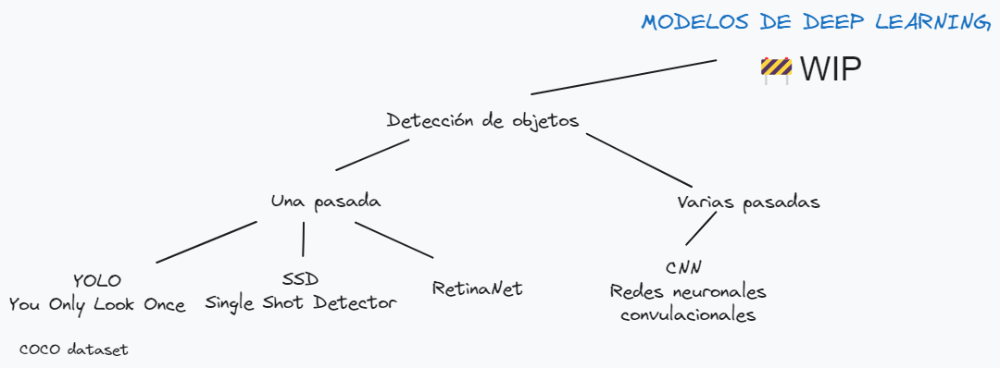

# Deep learning y ArcGIS

Este repositorio me sirve personalmente para ordenar las ideas y conceptos relacionados con el deep learning y su uso con la tecnología de ArcGIS. 

## Clasificación de imágenes y detección de objetos
La **clasificación de imágenes** por ordenador coge una imagen y predice el objeto que contiene mientras que la **detección de objetos** predice el objeto y encuentra su ubicación en términos de cuadros delimitadores. Por ejemplo, un clasificador de piscinas nos dirá si en la imagen hay piscinas, mientras que un modelo de detección nos dirá si hay piscina y dónde está. De forma que un modelo de detección nos dirá:
- La probabilidad de que haya ese objeto
- La altura de la caja delimitadora
- El ancho de la caja delimitadora
- La coordenada horizontal del centro de la caja
- Y la coordenada vertical del centro de la caja

Esto es en términos generales, también dependerá del modelo y su implementación.

Podemos decir que, en la práctica, hay dos tipos de algoritmos de detección de objetos:
* Algoritmos como R-CNN y Fast(er) R-CNN que hacen el trabajo en dos pasos:
    1. Identifican las regiones en las que se espera encontrar objetos.
    2. Detectan los objetos solo en esas regiones utilizando convnet (redes convolucionales).

* Algoritmos de una pasada como YOLO (You Only Look Once) y SSD (Single-Shot Detector) que son capaces de encontrar todos los objetos de una sola pasada gracias al enfoque convolucional de su red. 

En comparación, los algoritmos de propuesta de región (primer grupo) suelen tener una precisión superior pero son más lentos en comparación con los de una única pasada que son bastante eficientes a pesar de hacer una única pasada. 

## Temas tratados:
1. [Modelo YOLOv3 con imágenes](./YOLOv3-imagenes/Imagenes.md)
2. [Modelo YOLOv3 con vídeos](./YOLOv3-imagenes/Videos.md)
3. [Modelos SSD](./SSD/Intro.md)

## Clasificación de píxeles

# Enlaces de interés
- [¡Redes Neuronales CONVOLUCIONALES! ¿Cómo funcionan?](https://www.youtube.com/watch?v=V8j1oENVz00&ab_channel=DotCSV)
- [¿Qué es una Red Neuronal?](https://www.youtube.com/watch?v=MRIv2IwFTPg&ab_channel=DotCSV)