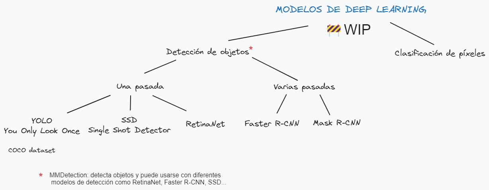
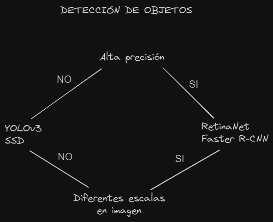
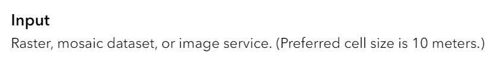
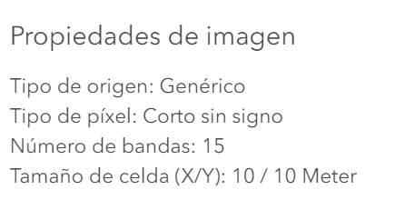
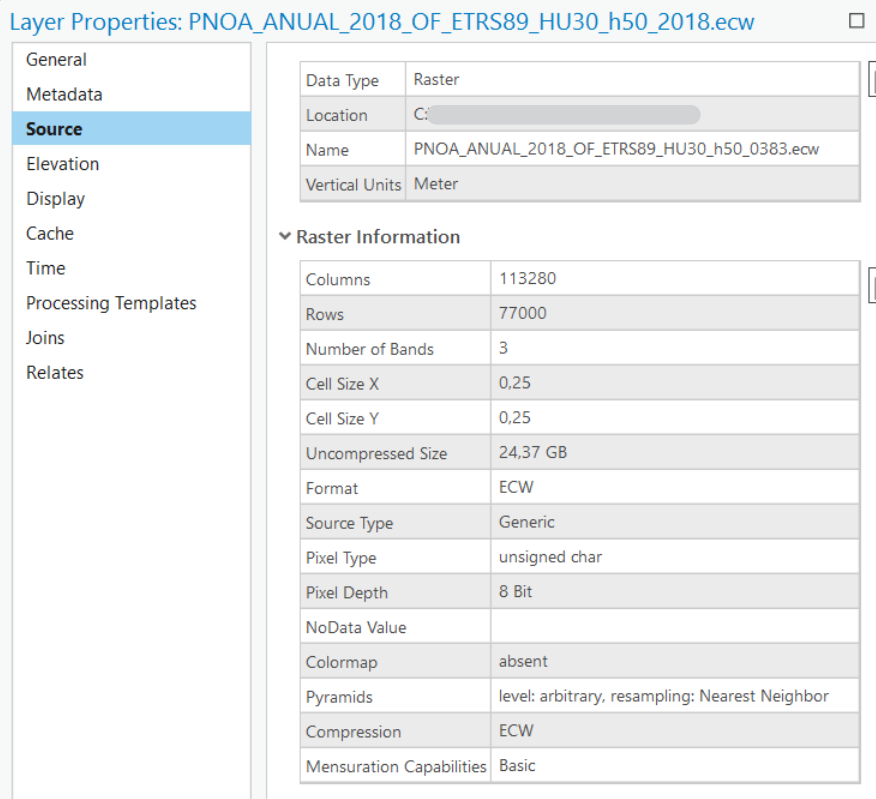

# Deep learning y ArcGIS

# WIP 🚧

Este repositorio me sirve personalmente para ordenar las ideas y conceptos relacionados con el deep learning y su uso con la tecnología de ArcGIS. 




> 🗒️[Conceptos básicos](./dummies/basic.md)

# Índice

1. [Introducción](#deep-learning-y-arcgis)
2. [Tipos de modelos](#modelos-de-deep-learning-en-arcgis)
    * [Detección de objetos](#detección-de-objetos)
    * [Clasificación de píxeles](#clasificación-de-píxeles)
3. [Modelos pre-entrenados](#modelos-preentrenados)
    * [Entrenar un modelo](#entrenamiento-de-un-modelo)
    * [Reentrenar un modelo](#re-entrenamiento-de-modelos)

# Modelos de deep learning en ArcGIS
Hay muchas aplicaciones de los modelos de deep learning en las tecnologías geo espaciales que permiten potenciar la capacidad analítica y predictiva. Por ejemplo, se pueden usar modelos para detectar y clasificar objetos en imágenes como en la detección de coches, reconocimento de patrones...

## Detección de objetos

La **clasificación de imágenes** por ordenador coge una imagen y predice el objeto que contiene mientras que la **detección de objetos** predice el objeto y encuentra su ubicación en términos de cuadros delimitadores. Por ejemplo, un clasificador de piscinas nos dirá si en la imagen hay piscinas, mientras que un modelo de detección nos dirá si hay piscina y dónde está. De forma que un modelo de detección nos dirá:
- La probabilidad de que haya ese objeto
- La altura de la caja delimitadora
- El ancho de la caja delimitadora
- La coordenada horizontal del centro de la caja
- Y la coordenada vertical del centro de la caja

Esto es en términos generales, también dependerá del modelo y su implementación.

Podemos decir que, en la práctica, hay dos tipos de algoritmos de detección de objetos:
* Algoritmos como R-CNN y Fast(er) R-CNN que hacen el trabajo en dos pasos:
    1. Identifican las regiones en las que se espera encontrar objetos.
    2. Detectan los objetos solo en esas regiones utilizando convnet (redes convolucionales).

* Algoritmos de una pasada como YOLO (You Only Look Once) y SSD (Single-Shot Detector) que son capaces de encontrar todos los objetos de una sola pasada gracias al enfoque convolucional de su red. 

En comparación, los algoritmos de propuesta de región (primer grupo) suelen tener una precisión superior pero son más lentos en comparación con los de una única pasada que son bastante eficientes a pesar de hacer una única pasada. 



### Modelos de detección de objetos
* [Single-Shot Detector](./SSD/Intro.md)
* [YOLOv3](./YOLOv3-imagenes/Imagenes.md)
* [Faster R-CNN](./FasterRCNN/Intro.md)
* [Mask R-CNN](./RCNN/Intro.md)
* [RetinaNet](./RetinaNet/Intro.md)
* MMDetection*

> *MMDetection no es un modelo de deep learning como tal sino que es un marco de código abierto para la detección de objetos que **puede usar diferentes modelos de deep learning** para ello como Faster R-CNN, SSD ...  es decir, modelos de una o varias pasadas.

## Clasificación de píxeles

La **segmentación de objetos** es una tarea en visión por ordenador que implica la asignación de una etiqueta a cada píxel de una imagen para indicar a qué objeto pertenece. Mientras que la detección de objetos identifica la presencia de objetos en una imagen y los delimita con cajas delimitadoras. 

En resumen, mientras que la detección de objetos nos dice qué objetos están presentes y dónde se encuentran en la imagen, la segmentación de objetos nos proporciona información detallada sobre la ubicación exacta de cada píxel perteneciente a un objeto específico.

Existen dos tipos principales de segmentación de objetos:

- **Segmentación semántica**: asigna una etiqueta a cada píxel para indicar a qué clase o categoría de objeto pertenece. Por ejemplo, en una imagen de calle puede haber píceles de la clas automóvil, peatón o edificio. 
- **Segmentación de instancias**: asigna una etiqueta a cada píxel y diferencia intancias del mismo tipo de objeto. Por ejemplo, si hay dos coches en una imagen, la segmentación de instancias distingue qué píxeles pertenecen a cada uno. 

Por ejemplo, si tenemos una imagen de una calle donde aparecen personas, coches y carreteras, la *segmentación semántica* asignará una etiqueta con una categoría (persona, coche, carretera) a cada píxel mientras que la *segmentación de instancias* clasificará los píxeles y asignará identificadores únicos a cada instancia individual de objeto. 

> Algunos modelos y bibliotecas populares para la segmentación de objetos incluyen U-Net, SegNet y MMSegmentation.


La **segmentación semántica también se llama clasificación de píxeles** y que consiste en la clasificación de cada píxel en determinadas categorías. Para hacer esta segmentación semántica hay dos inputs de información:
- Una imagen raster con varias bandas.
- Una imagen de etiqueta que contiene etiquetas para cada píxel. 

Hay diferentes algoritmos de segmentación semántica como U-net, Mask R-CNN, Feature Pyramid Network, etc. Uno de los más reconocidos en U-net. 

### Modelos de clasificación de píxeles
* [U-Net](./U-Net/Intro.md)
* [PSPNet](./PSPNet/Intro.md)


# Modelos preentrenados

Lo ideal es tener tiempo y recursos para entrenar tus propios modelos porque será cuando se llegue a la mejor conclusión pero no es real, muchas veces tendremos que utilizar modelos pre-entrenados por otras personas. Un sitio del que podemos obtener modelos pre-entrenados es el Living Atlas donde hay más de [70 dlpks](https://livingatlas.arcgis.com/en/browse/?q=dlpk#q=dlpk&d=2) compartidos de distintas temáticas.

Para poder utilizar un modelo preentrenado debemos cumplir algunos requisitos como el tipo de dato de entrada y si es una imagen, su resolución. 

Por ejemplo, en el modelo [clasificación de cobertura del suelo](https://www.arcgis.com/home/item.html?id=afd124844ba84da69c2c533d4af10a58) podemos ver como se necesita una imagen ráster con una resolución de 10 metros.


Podemos ver las características de la imagen con la que vamos a trabajar en:
1. **ArcGIS Online** viendo el detalle del elemento donde está alojada la imagen.


2. En **ArcGIS Pro** en las propiedades del elemento podemos ver el cell size así como el número de bandas de la imagen. 



Puede que un modelo pre-entrenado no nos valga porque esté entrenado con datos concretos y no sea aplicable en nuestros datos. Por ejemplo, es un modelo de detección de piscinas cuadradas y nosotros tenemos piscinas redondas. Para solucionar esto tenemos dos alternativas: entrenar un modelo desde cero o reentrenar un modelo.

## Entrenamiento de un modelo

El elemento esencial para entrenar un modelo son los datos porque a partir de ellos podremos usar la función [*prepare_data*](https://developers.arcgis.com/python/api-reference/arcgis.learn.toc.html#prepare_data) que nos devolverá un objeto *data* que contendrá un conjunto de datos de entrenamiento y de validación con información sobre la transformación, tamaño del chip, etc. 

Una vez que tenemos los datos, tendremos que cargar la **arquitectura del modelo** que mejor se adapte al tipo de algoritmo que queremos aplicar. Para la definición de esos modelos tendremos que pasarle como parámetros esos datos que acabamos de preparar. 

Cuando tengamos definido el modelo solo hay que entrenarlo para lo cual tendremos que encontrar su tasa de aprendizaje y lanzar unas cuantas *epochs* 
> Este número será más alto que si estuviésemos re-entrenado el modelo y es por eso que se dice que siempre es mejor re-entrenar un modelo que hacerlo desde cero ya que se necesitan muchos más recursos. 

## Re-entrenamiento de modelos

Si utilizamos un modelo pre-entrenado pero este no se ajusta bien a nuestro conjunto de dato podemos mejorar el ajuste del modelo con nuestros datos. Este proceso será mucho más rápido que entrenar un modelo desde cero y para ello seguiremos tres pasos:
1. Cargar datos de entrenamiento
2. Afinar el modelo pre-entrenado
3. Desplegar el modelo

### Cargar datos de entrenamiento

Prepararemos los datos con la función *prepare_data* a la que le pasaremos el path de nuestros datos. 

```python
from arcgis.gis import GIS
gis = GIS('home')
portal = GIS('https://pythonapi.playground.esri.com/portal')

training_data = gis.content.get('5351aca735604197ac8d8ede45f6cc4b')
training_data

filepath = training_data.download(file_name=training_data.name)

import zipfile
from pathlib import Path
with zipfile.ZipFile(filepath, 'r') as zip_ref:
    zip_ref.extractall(Path(filepath).parent)

data_path = Path(filepath).parent / 'building_footprints'

from arcgis.learn import prepare_data
data = prepare_data(data_path, 
                    batch_size=16, 
                    chip_size=400)


# Viaualizar datos de entrenamiento
data.show_batch(rows=4)
```

### Ajuste del modelo

De la página de Living Atlas podemos descargar el modelo a través de su identificador. 
```python
model_item = gis.content.get('a6857359a1cd44839781a4f113cd5934')
model_item

model_path = model_item.download(file_name=model_item.name)
```

Una vez descargado el modelo, podemos cargarlo con la función *from_model*
```python
from arcgis.learn import MaskRCNN
model = MaskRCNN.from_model(model_path, data)
```

A continuación, lo lógico sería probar el modelo tal cual con nuestros datos. 
```python
model.show_results()
```

También podemos obtener la **tasa de aprendizaje** que es uno de los hiper parámetros más importantes en el entrenamiento de modelos. El método *lr_find()* encuentra la tasa de aprendizaje óptima que nos permite ajustar el modelo. 
```python
lr = model.lr_find()
```

### Entrenamiento del modelo
Una vez que tenemos la tasa de aprendizaje, podemo usarla para entrenar el modelo.
```python
model.fit(10, lr=lr)
```

Así hemos **reentrenado el modelo** y por ello, si mostramos de nuevo el resultado, veremos que se ajusta mejor a nuestros datos.
```python
model.show_results()
```

### Guardar el modelo
Una vez que tenemos el modelo reentrenado y que se ajuste mejor a nuestros datos, tan solo tendremos que guardar el modelo:
```python
model.save("New_building_footprint")
```

# Enlaces de interés
- [¡Redes Neuronales CONVOLUCIONALES! ¿Cómo funcionan?](https://www.youtube.com/watch?v=V8j1oENVz00&ab_channel=DotCSV)
- [¿Qué es una Red Neuronal?](https://www.youtube.com/watch?v=MRIv2IwFTPg&ab_channel=DotCSV)
- [Finetuning pre-trained model](https://developers.arcgis.com/python/samples/finetuning-pre-trained-building-footprint-model/#model-finetuning)
- [Deep Learning with ArcGIS Pro Tips & Tricks](https://www.esri.com/arcgis-blog/products/arcgis-pro/mapping/deep-learning-with-arcgis-pro-tips-tricks-part-2/)
- [Parameters and Hyperparameters in ML and DL](https://towardsdatascience.com/parameters-and-hyperparameters-aa609601a9ac#:~:text=Simply%20put%2C%20parameters%20in%20machine,choice%20of%20hyperparameters%20you%20provide.)