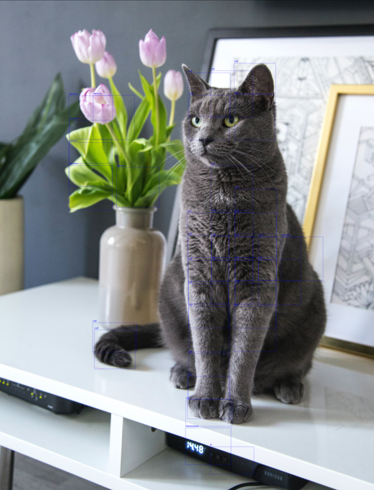

# Detección de objetos con YOLOv3

El modelo de detección de objetos YOLO (You Only Look Once) es uno de los más utilizados ya que nos permite hacer detecciones en tiempo real con predicciones bastante acertadas. 

Una de las mayores ventajas de YOLOv3 en *arcgis.learn* es que viene precargado con pesos previamente entrenados en el conjunto de datos COCO. Esto le permite estar listo para usarse con 80 objetos comunes como coche, camión, persona...

## Arquitectura del modelo
YOLOv3 usa Darknet-53 como red troncal. Como su nombre indica, Darknet-53 tiene 53 capas convulacionales y también tiene una mejor adaptación de las capas residuales de estilo ResNet permitiéndole tener una mejor precisión. 

La nueva versión de YOLO ha mejorado las versiones anteriores gracias al muestreo ascendente y la concatenación de capas. Además, se usan tres escalas para la detección de elementos lo cual permite la detección de objetos a distintas escalas de una imagen. 


## Uso con ArcGIS API for Python

### Carga del modelo
Podemos implementar este modelo a través del módulo *arcgis.learn*.

```python
from arcgis.learn import YOLOv3
model = YOLOv3(data) 
```
La variable *data* es el conjunto de datos preparado para el entrenamiento, resultado de la función *[prepare_data](https://developers.arcgis.com/python/api-reference/arcgis.learn.toc.html#arcgis.learn.prepare_data)*. 

Pero si no tenemos datos de entrenamiento o queremos probar con los pesos preentrados de COCO podemos cargar el modelo simplemente con:
```python
model = YOLOv3()
```
Las 80 clases que nos proporciona el conjunto de datos COCO incluye las siguientes clases:
'person', 'bicycle', 'car', 'motorcycle', 'airplane', 'bus', 'train', 'truck',
'boat', 'traffic light', 'fire hydrant', 'stop sign',
'parking meter', 'bench', 'bird', 'cat', 'dog', 'horse', 'sheep', 'cow',
'elephant', 'bear', 'zebra', 'giraffe', 'backpack', 'umbrella',
'handbag', 'tie', 'suitcase', 'frisbee', 'skis',
'snowboard', 'sports ball', 'kite', 'baseball bat', 'baseball glove',
'skateboard', 'surfboard', 'tennis racket', 'bottle', 'wine glass',
'cup', 'fork', 'knife', 'spoon', 'bowl', 'banana', 'apple', 'sandwich',
'orange', 'broccoli', 'carrot', 'hot dog', 'pizza', 'donut', 'cake', 'chair',
'couch', 'potted plant', 'bed', 'dining table',
'toilet', 'tv', 'laptop', 'mouse', 'remote', 'keyboard', 'cell phone',
'microwave', 'oven', 'toaster', 'sink', 'refrigerator', 'book',
'clock', 'vase', 'scissors', 'teddy bear', 'hair drier', 'toothbrush'


### Uso del modelo
Una vez que tenemos (entrenado y) cargado el modelo podemos empezar a usarle con nuestras imágenes o vídeos.

En la [documentación](https://developers.arcgis.com/python/api-reference/arcgis.learn.toc.html#yolov3) tenemos todos los métodos para el modelo YOLOv3. Para usarlo sobre imágenes tendremos que usar el método *predict()* y para usarlo con vídeos, el método *predict_video()*

```python
from arcgis.learn import YOLOv3
model = YOLOv3() 
# Imágenes
model.predict(image_path)
# Vídeos
model.predict_video(input_video_path, metadata_file)
```

### Ejemplos de uso
Como siempre, la ArcGIS API for Python se puede utilizar en diferentes entornos (local, ArcGIS Pro, ArcGIS Online...) 

#### Analizar una única imagen
En este ejemplo vamos a cargar una imagen que tengamos en local y ver qué encuentra el modelo los ajustes a través de los parámetros son clave para ajustar las predicciones.

> Este ejemplo está hecho dentro de un ArcGIS Notebook en ArcGIS Pro

```python
from arcgis.learn import YOLOv3

# Cargar imagen
cats_path = r"C:\XXXXXX\PruebasDL\cat.jpg"

# Definir modelo con datos pre-entrenados de COCO
yolo = YOLOv3()

# Previsualizar la imagen en el propio ArcGIS Notebook de ArcGIS Pro
import matplotlib.pyplot as plt
import matplotlib.image as mpimg

# Cargar la imagen
img = mpimg.imread(cats_path)

# Mostrar la imagen
plt.imshow(img)
plt.axis('off')  # Desactivar los ejes
plt.show()

# Imagen que vamos a utilizar: 
```


Foto de <a href="https://unsplash.com/es/@milada_vigerova?utm_content=creditCopyText&utm_medium=referral&utm_source=unsplash">Milada Vigerova</a> en <a href="https://unsplash.com/es/fotos/gato-azul-ruso-sobre-mesa-blanca-7E9qvMOsZEM?utm_content=creditCopyText&utm_medium=referral&utm_source=unsplash">Unsplash</a>

```python
# Obtener predicciones
predictions = yolo.predict(cats_path)

# Como no le hemos pasado más parámetros ha usado los valores por defecto y nos ha devuelto todo lo que tenga un nivel de confianza mayor a 0.1. Esta será la lista de elementos encontrados:
categories = predictions[1]
print("Lista de categorías encontradas:")
for category in set(categories):
    print(category)

# Lista de categorías encontradas:
sink
tv
apple
cat
surfboard
cell phone
tie
wine glass
bed
person
microwave
keyboard
couch
dog
laptop
bear
cup
sports ball
teddy bear

# Si ajustamos ese parámetro y le pedimos que muestre el resultado vemos que se adapta mejor
predictions = yolo.predict(cats_path, 
                           threshold=0.6, 
                           visualize=True)
categories = predictions[1]
print("Lista de categorías encontradas:")
for category in set(categories):
    print(category)

# Lista de categorías encontradas:
microwave
tv
person
cat
```

```python
# Nos detecta muchos elementos cuando deberían ser parte de uno más grande, nos falta el parámetro resize como True
predictions = yolo.predict(cats_path, 
                           threshold=0.6,
                           resize=True,
                           visualize=True)
categories = predictions[1]
print("Lista de categorías encontradas:")
for category in set(categories):
    print(category)

# Lista de categorías encontradas:
vase
cat
```


> Método *[predict](https://developers.arcgis.com/python/api-reference/arcgis.learn.toc.html#yolov3)* con la definición de todos sus **parámetros**


#### Analizar imágenes adjuntas a una capa de datos
Analizar una única imagen está bien para hacer pruebas pero si tenemos interés en utilizar el deep learning y la tecnología de ArcGIS es porque queremos analizar datos con carácter espacial y esos, normalmente, van a estar disponibles como una imagen adjunta en una capa.

En este ejemplo vamos a **analizar imágenes adjuntas a los datos de una FeatureLayer alojada en ArcGIS Online**. 

Los pasos que vamos a seguir son:
1. Cargar las librerías necesarias.
2. Acceder a la capa de datos que tiene las imágenes adjuntas que queremos analizar.
3. Cargar el modelo que vamos a utilizar: YOLOv3.
4. Acceder a cada uno de los registros para:
    - Acceder a la variable que tiene la URL de la imagen
    - Aplicar el modelo de predicción
    - Editar las columnas de cada registro con el número de elementos encontrados
    - Adjuntar la imagen original y la de las predicciones

```python
### 1. Carga de librerías
import cv2 # Para operaciones de visión por ordenador como dibujar cuadros y texto en imágenes
import arcgis # Para acceder a servicios y datos de ArcGIS Online
# import time
import imageio # Para leer y escribir imágenes y vídeos en diferentes formatos
import tempfile # Para crear un directorio temporal
import shutil # Para manipular archivos y directorios
import requests # Para hacer solicitudes HTTP
import numpy as np # Manipulación de matrices
import pandas as pd # Para manipular datos con dataframes
from PIL import Image # Para abrir, manipular y guardar imágenes
from io import BytesIO # Para trabajar con datos binarios (convertir la respuesta de una solicitud HTTP en un objeto de imagen que pueda ser procesado por PIL)

from arcgis.gis import GIS
gis = GIS("home")

from arcgis.learn import YOLOv3

### 2. Acceso a los datos
id = "13c0065c40984c34baae3493061646ce"

# Acceso a la capa de datos
TFLTrafficCameras = gis.content.get(id).layers[0]

# Convertir capa a dataframe
TFLTrafficCamerasDataFrame = TFLTrafficCameras.query(as_df=True)
TFLTrafficCamerasDataFrame.shape
(51, 18)

### 3. Carga del modelo
yolo = YOLOv3()

# Colores para cada uno de los elementos que nos interesa del modelo
# Los colores en cv2 son BGR y no RGB como estamos acostumbrados
COLORS = {
    'car': (0, 112, 255), #azul
    'bus': (255, 170, 0), #naranja
    'truck': (197, 0, 255), #morado
    'person': (56, 168, 0), #verde
    'stop_sign': (223, 15, 40) #rojo
}

### 4. Ejecutar modelo para cada registro

# Archivo temporal para guardar las imágenes mientras el modelo está ejecutándose
dirpath = tempfile.mkdtemp()

# Iteración sobre cada fila del dataframe
for index, row in TFLTrafficCamerasDataFrame.iterrows():
    # No tenemos la imagen como tal, sino que tenemos acceso a la URL de la imagen guardada enla variable "cameraId"
    response = requests.get(row['cameraId'])
    if response.status_code == 200:
        
        # Convertimos la respuesta en un array de numpy que representará la imagen
        image_np = np.array(Image.open(BytesIO(response.content))).copy()

        # Agregar esta línea para asegurarse de que la imagen sea escribible
        image_np.setflags(write=True)
        
        # Eliminamos los archivos adjuntos que haya en cada registro
        attachmentList = TFLTrafficCameras.attachments.get_list(row['FID'])
        if attachmentList:
            for attachment in attachmentList:
                TFLTrafficCameras.attachments.delete(row['FID'],attachment['id'])
        
        try:        
            # Ejecutamos el modelo sobre cada imagen (array numpy) con umbral a 0.6
            predictions = yolo.predict(image_np, visualize=False, threshold=0.6)

            # Si hay predicciones
            if predictions[0]:
                # Creamos un df a partir de predictions[1] que será donde esté guardada la información de las predicciones
                df = pd.DataFrame(np.stack((predictions[1]), axis=-1))

                # Obtenemos featureset del elemento correspondiente (por FID)
                featureSet = TFLTrafficCameras.query(where="FID=" + str(row['FID']))
                feature_edit = featureSet.features[0]

                # Preparamos el objeto (feature_edit) que tendrá la estructura correcta para editar el elemento
                # Por cada categoría que nos interesa, contaremos el número de veces que aparece en el df de predicciones definido antes
                feature_edit.attributes['Trucks'] = int(df[df[0] == 'truck'].count().iloc[0])
                feature_edit.attributes['Buses'] = int(df[df[0] == 'bus'].count().iloc[0])
                feature_edit.attributes['Cars'] = int(df[df[0] == 'car'].count().iloc[0])
                feature_edit.attributes['Pedestrians'] = int(df[df[0] == 'person'].count().iloc[0])
                feature_edit.attributes['stop_sign'] = int(df[df[0] == 'stop sign'].count().iloc[0])

                # Actualizamos la información del elemento en la tabla de datos
                TFLTrafficCameras.edit_features(updates=[feature_edit])

                # Añadimos la imagen original como un adjunto                           
                image_out = imageio.imwrite(dirpath + '/image.jpg', image_np)
                TFLTrafficCameras.attachments.add(row['FID'] , dirpath + '/image.jpg')

                # Pintamos cuadro y texto sobre la imagen con las predicciones
                for i in range(len(predictions[0])):
                    label = predictions[1][i]
                    if label in ['car', 'bus', 'truck','person', 'stop sign']:
                        x1,y1,x2,y2 = (int(predictions[0][i][0]),
                               int(predictions[0][i][1]+predictions[0][i][3]),
                               int(predictions[0][i][0] + predictions[0][i][2]),
                               int(predictions[0][i][1]))
                        label = predictions[1][i]
                        if label == 'car':                          
                            cv2.rectangle(image_np,(x1-5,y1+5),(x2,y2),(0, 112, 255),3)
                            cv2.putText(image_np,label,(x1,y1),cv2.FONT_HERSHEY_COMPLEX,0.5,COLORS['car'],1)
                        if label == 'bus':                          
                            cv2.rectangle(image_np,(x1-5,y1+5),(x2,y2),(255, 170, 0),3)
                            cv2.putText(image_np,label,(x1,y1),cv2.FONT_HERSHEY_COMPLEX,0.5,COLORS['bus'],1)
                        if label == 'truck':                          
                            cv2.rectangle(image_np,(x1-5,y1+5),(x2,y2),(197, 0, 255),3)
                            cv2.putText(image_np,label,(x1,y1),cv2.FONT_HERSHEY_COMPLEX,0.5,COLORS['truck'],1)
                        if label == 'person':                          
                            cv2.rectangle(image_np,(x1-5,y1+5),(x2,y2),(56, 168, 0),3)
                            cv2.putText(image_np,label,(x1,y1),cv2.FONT_HERSHEY_COMPLEX,0.5,COLORS['person'],1)
                        if label == 'stop sign':
                            cv2.rectangle(image_np,(x1-5,y1+5),(x2,y2),COLORS['stop_sign'],3)
                            cv2.putText(image_np,label,(x1,y1),cv2.FONT_HERSHEY_COMPLEX,0.5,COLORS['stop_sign'],1)

                # Añadir la imagen de las predicciones ocmo adjunto
                image_prediction = imageio.imwrite(dirpath + '/image_predictions.jpg', image_np)
                TFLTrafficCameras.attachments.add(row['FID'] , dirpath + '/image_predictions.jpg')
            else:
                # Si no hay predicciones, poner todos los campos a 0                               
                featureSet = TFLTrafficCameras.query(where="FID=" + str(row['FID']))
                feature_edit.attributes['Trucks'] = 0
                feature_edit.attributes['Buses'] = 0
                feature_edit.attributes['Cars'] = 0
                feature_edit.attributes['Pedestrians'] = 0
                feature_edit.attributes['stop_sign'] = 0
                TFLTrafficCameras.edit_features(updates=[feature_edit])
        except:
           print("An exception occurred")

print("Modelo ejecutado")
# Eliminar archivo temporal
shutil.rmtree(dirpath)

```

### Enlaces de interés
* [YOLOv3 Object Detector](https://developers.arcgis.com/python/guide/yolov3-object-detector/)
* [COCO dataset](https://cocodataset.org/#home)
* [Métodos YOLOv3 detector en arcgis.learn](https://developers.arcgis.com/python/api-reference/arcgis.learn.toc.html#yolov3)

