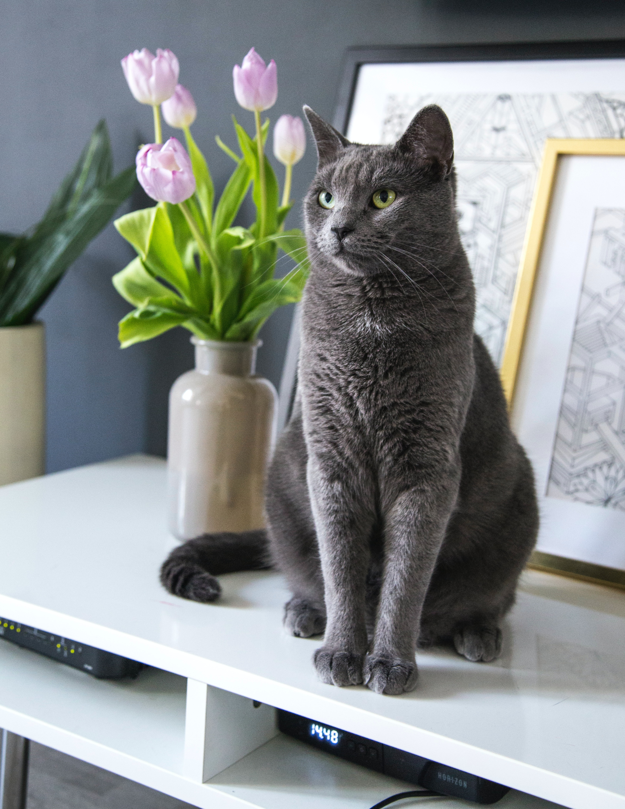
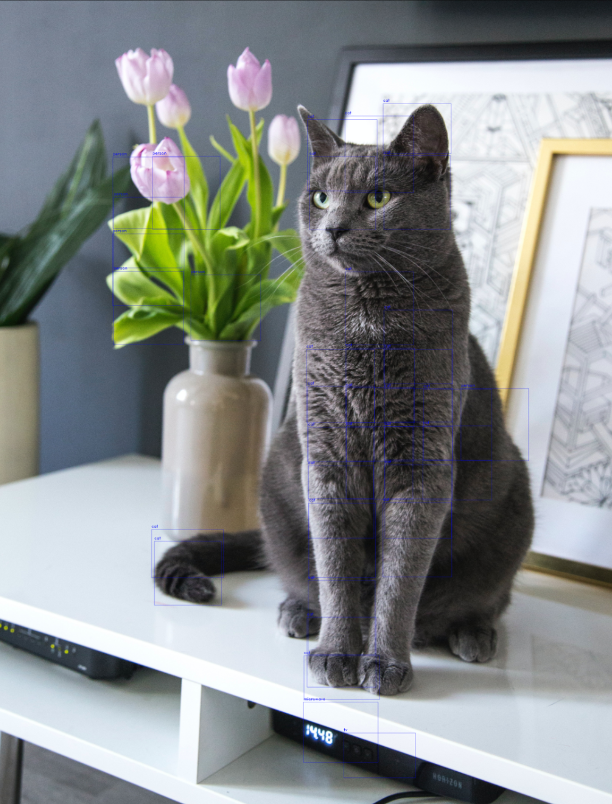
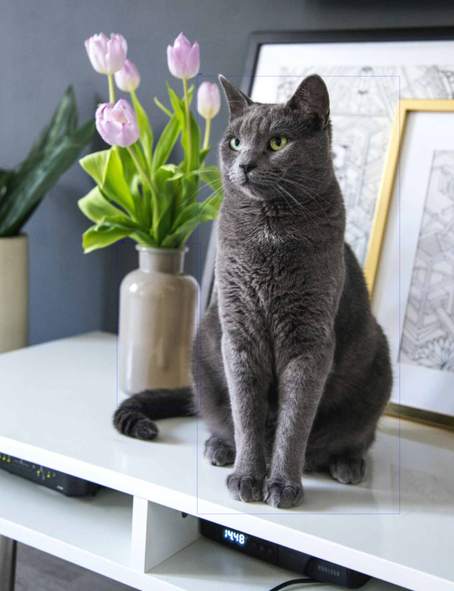

# Detección de objetos con YOLOv3

El modelo de detección de objetos YOLO (You Only Look Once) es uno de los más utilizados ya que nos permite hacer detecciones en tiempo real con predicciones bastante acertadas. 

Una de las mayores ventajas de YOLOv3 en *arcgis.learn* es que viene precargado con pesos previamente entrenados en el conjunto de datos COCO. Esto le permite estar listo para usarse con 80 objetos comunes como coche, camión, persona...

## Arquitectura del modelo
YOLOv3 usa Darknet-53 como red troncal. Como su nombre indica, Darknet-53 tiene 53 capas convulacionales y también tiene una mejor adaptación de las capas residuales de estilo ResNet permitiéndole tener una mejor precisión. 

La nueva versión de YOLO ha mejorado las versiones anteriores gracias al muestreo ascendente y la concatenación de capas. Además, se usan tres escalas para la detección de elementos lo cual permite la detección de objetos a distintas escalas de una imagen. 


## Uso con ArcGIS API for Python

### Carga del modelo
Podemos implementar este modelo a través del módulo *arcgis.learn*.

```python
from arcgis.learn import YOLOv3
model = YOLOv3(data) 
```
La variable *data* es el conjunto de datos preparado para el entrenamiento, resultado de la función *[prepare_data](https://developers.arcgis.com/python/api-reference/arcgis.learn.toc.html#arcgis.learn.prepare_data)*. 

Pero si no tenemos datos de entrenamiento o queremos probar con los pesos preentrados de COCO podemos cargar el modelo simplemente con:
```python
model = YOLOv3()
```
Las 80 clases que nos proporciona el conjunto de datos COCO incluye las siguientes clases:
'person', 'bicycle', 'car', 'motorcycle', 'airplane', 'bus', 'train', 'truck',
'boat', 'traffic light', 'fire hydrant', 'stop sign',
'parking meter', 'bench', 'bird', 'cat', 'dog', 'horse', 'sheep', 'cow',
'elephant', 'bear', 'zebra', 'giraffe', 'backpack', 'umbrella',
'handbag', 'tie', 'suitcase', 'frisbee', 'skis',
'snowboard', 'sports ball', 'kite', 'baseball bat', 'baseball glove',
'skateboard', 'surfboard', 'tennis racket', 'bottle', 'wine glass',
'cup', 'fork', 'knife', 'spoon', 'bowl', 'banana', 'apple', 'sandwich',
'orange', 'broccoli', 'carrot', 'hot dog', 'pizza', 'donut', 'cake', 'chair',
'couch', 'potted plant', 'bed', 'dining table',
'toilet', 'tv', 'laptop', 'mouse', 'remote', 'keyboard', 'cell phone',
'microwave', 'oven', 'toaster', 'sink', 'refrigerator', 'book',
'clock', 'vase', 'scissors', 'teddy bear', 'hair drier', 'toothbrush'


### Uso del modelo
Una vez que tenemos (entrenado y) cargado el modelo podemos empezar a usarle con nuestras imágenes o vídeos.

En la [documentación](https://developers.arcgis.com/python/api-reference/arcgis.learn.toc.html#yolov3) tenemos todos los métodos para el modelo YOLOv3. Para usarlo sobre imágenes tendremos que usar el método *predict()* y para usarlo con vídeos, el método *predict_video()*

```python
from arcgis.learn import YOLOv3
model = YOLOv3() 
# Imágenes
model.predict(image_path)
# Vídeos
model.predict_video(input_video_path, metadata_file)
```

### Ejemplos de uso
Como siempre, la ArcGIS API for Python se puede utilizar en diferentes entornos (local, ArcGIS Pro, ArcGIS Online...) 

#### Analizar una única imagen
En este ejemplo vamos a cargar una imagen que tengamos en local y ver qué encuentra el modelo los ajustes a través de los parámetros son clave para ajustar las predicciones.

> Este ejemplo está hecho dentro de un ArcGIS Notebook en ArcGIS Pro

```python
from arcgis.learn import YOLOv3

# Cargar imagen
cats_path = r"C:\XXXXXX\PruebasDL\cat.jpg"

# Definir modelo con datos pre-entrenados de COCO
yolo = YOLOv3()

# Previsualizar la imagen en el propio ArcGIS Notebook de ArcGIS Pro
import matplotlib.pyplot as plt
import matplotlib.image as mpimg

# Cargar la imagen
img = mpimg.imread(cats_path)

# Mostrar la imagen
plt.imshow(img)
plt.axis('off')  # Desactivar los ejes
plt.show()

# Imagen que vamos a utilizar: 
```


Foto de <a href="https://unsplash.com/es/@milada_vigerova?utm_content=creditCopyText&utm_medium=referral&utm_source=unsplash">Milada Vigerova</a> en <a href="https://unsplash.com/es/fotos/gato-azul-ruso-sobre-mesa-blanca-7E9qvMOsZEM?utm_content=creditCopyText&utm_medium=referral&utm_source=unsplash">Unsplash</a>

```python
# Obtener predicciones
predictions = yolo.predict(cats_path)

# Como no le hemos pasado más parámetros ha usado los valores por defecto y nos ha devuelto todo lo que tenga un nivel de confianza mayor a 0.1. Esta será la lista de elementos encontrados:
categories = predictions[1]
print("Lista de categorías encontradas:")
for category in set(categories):
    print(category)

# Lista de categorías encontradas:
sink
tv
apple
cat
surfboard
cell phone
tie
wine glass
bed
person
microwave
keyboard
couch
dog
laptop
bear
cup
sports ball
teddy bear

# Si ajustamos ese parámetro y le pedimos que muestre el resultado vemos que se adapta mejor
predictions = yolo.predict(cats_path, 
                           threshold=0.6, 
                           visualize=True)
categories = predictions[1]
print("Lista de categorías encontradas:")
for category in set(categories):
    print(category)

# Lista de categorías encontradas:
microwave
tv
person
cat
```

```python
# Nos detecta muchos elementos cuando deberían ser parte de uno más grande, nos falta el parámetro resize como True
predictions = yolo.predict(cats_path, 
                           threshold=0.6,
                           resize=True,
                           visualize=True)
categories = predictions[1]
print("Lista de categorías encontradas:")
for category in set(categories):
    print(category)

# Lista de categorías encontradas:
vase
cat
```



> Método *[predict](https://developers.arcgis.com/python/api-reference/arcgis.learn.toc.html#yolov3)* con la definición de todos sus **parámetros**


### Enlaces de interés
* [YOLOv3 Object Detector](https://developers.arcgis.com/python/guide/yolov3-object-detector/)
* [COCO dataset](https://cocodataset.org/#home)
* [Métodos YOLOv3 detector en arcgis.learn](https://developers.arcgis.com/python/api-reference/arcgis.learn.toc.html#yolov3)

