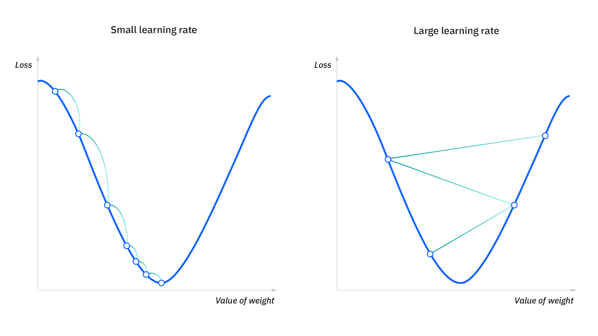

# Conceptos básicos

Glosario y explicación de conceptos básicos de DL y ML que se ve en el resto del repositorio. 

* **Neurona**: es la unidad básica de procesamiento de una red neuronal. Esta neurona recibirá valores de entrada con los que realizará un cálculo interno y dará un resultado, es decir, *una neurona es una función* que realizará una suma ponderada en función del *peso* que se le asigne a cada valor de entrada. 
    
    El resultado de la neurona será, en el fondo, una línea a la cual podremos desplazar aplicando un sesgo (bias-b).
    

* **Redes neuronales**: es el conjunto de neuronas organizadas en capas. Dos neuronas que se encuentran en la misma capa recibirán los mismos valores de entrada y pasaran su resultado a la capa siguiente. 
    

    Cuantas más capas añadimos, más complejo será el conocimiento que elaboremos, más profundidad y de ahí viene el concepto de **deep learning**

    

* **Función de activación**: función que distorsionará el valor de salida de la neurona (función) añadiéndole deformaciones no lineales para que así se pueda encadenar la computación de varias neuronas. 

* **Red neuronal convolucional (CNN)**: es un tipo de red neuronal que se caracteriza por  aplicar un tipo de capa donde se realiza una operación matemática conocida como convolución que se utiliza para aplicar filtros o kernels. Sobre la imagen original se aplicará este filtro que calculará el valor para píxel teniendo en cuenta el valor de los píxeles vecinos.
 

    Al desplazarse ese filtro por toda la imagen obtendremos una nueva imagen muy influenciada por el kernel que hayamos definido. Es decir, en función del filtro aplicado podemos detectar unos patrones u otros en la imagen. 

    Los valores del filtro los definirá la red neuronal en función de lo que vaya aprendiendo para **encontrar patrones**. A cada imagen generada se le conoce como **mapa de características**. 

* **Hiperparámetros**: son parámetros cuyos valores controlan el proceso de aprendizaje y determinan los valores de los parámetros de salida de los modelos. Algunos de esos hiperparámetros son: la tasa de aprendizaje, función de activación de la red neuronal, red neuronal, número de iteraciones (epochs), etc. 

* **Parámetros**: son los valores que el algoritmo puede cambiar de forma independiente a medida que aprende. Estos valores se ven afectados por los hiperparámetros elegidos al inicio. Por ejemplo: el sesgo, los pesos de las variables, coeficientes... 

* **Tasa de aprendizaje**: es el hiperparámetro fundamental en los algoritmos para entrenar modelos de aprendizaje automático. Es un hiperparámetro crucial que controla la magnitud de los ajustes que se hacen a los pesos de un modelo durante el proceo de entrenamiento. 
    - Una **tasa de aprendizaje demasiado alta** puede provocar un entrenamiento inestable donde los valores de los pesos sean cada vez más grandes en vez de acercarse a una solución óptima así como problemas de overfitting, es decir, aprender tanto de los datos del modelo que no sea capaz de extrapolar.

    - Una tasa de aprendizaje **demasiado baja** puede hacer que el proceso de convergencia sea muy lento. 

    

    > Como se ve en la imagen, una tasa de aprendizaje muy baja puede provocar que el modelo se quede atascado en mínimo locales y una muy alta, inestabilidad. 