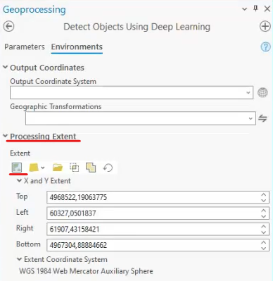

# Conceptos básicos

Glosario y explicación de conceptos básicos de DL y ML que se ve en el resto del repositorio. 

* **Neurona**: es la unidad básica de procesamiento de una red neuronal. Esta neurona recibirá valores de entrada con los que realizará un cálculo interno y dará un resultado, es decir, *una neurona es una función* que realizará una suma ponderada en función del *peso* que se le asigne a cada valor de entrada. 
    
    El resultado de la neurona será, en el fondo, una línea a la cual podremos desplazar aplicando un sesgo (bias-b).
    

* **Redes neuronales**: es el conjunto de neuronas organizadas en capas. Dos neuronas que se encuentran en la misma capa recibirán los mismos valores de entrada y pasaran su resultado a la capa siguiente. 
    

    Cuantas más capas añadimos, más complejo será el conocimiento que elaboremos, más profundidad y de ahí viene el concepto de **deep learning**

    


* **Función de activación**: función que distorsionará el valor de salida de la neurona (función) añadiéndole deformaciones no lineales para que así se pueda encadenar la computación de varias neuronas. 


* **Red neuronal convolucional (CNN)**: es un tipo de red neuronal que se caracteriza por  aplicar un tipo de capa donde se realiza una operación matemática conocida como convolución que se utiliza para aplicar filtros o kernels. Sobre la imagen original se aplicará este filtro que calculará el valor para píxel teniendo en cuenta el valor de los píxeles vecinos.
 

    Al desplazarse ese filtro por toda la imagen obtendremos una nueva imagen muy influenciada por el kernel que hayamos definido. Es decir, en función del filtro aplicado podemos detectar unos patrones u otros en la imagen. 

    Los valores del filtro los definirá la red neuronal en función de lo que vaya aprendiendo para **encontrar patrones**. A cada imagen generada se le conoce como **mapa de características**. 


* **Hiperparámetros**: son parámetros cuyos valores controlan el proceso de aprendizaje y determinan los valores de los parámetros de salida de los modelos. Algunos de esos hiperparámetros son: la tasa de aprendizaje, función de activación de la red neuronal, red neuronal, número de iteraciones (epochs), etc. 


* **Parámetros**: son los valores que el algoritmo puede cambiar de forma independiente a medida que aprende. Estos valores se ven afectados por los hiperparámetros elegidos al inicio. Por ejemplo: el sesgo, los pesos de las variables, coeficientes... 


* **Tasa de aprendizaje**: es el hiperparámetro fundamental en los algoritmos para entrenar modelos de aprendizaje automático. Es un hiperparámetro crucial que controla la magnitud de los ajustes que se hacen a los pesos de un modelo durante el proceo de entrenamiento. 
    - Una **tasa de aprendizaje demasiado alta** puede provocar un entrenamiento inestable donde los valores de los pesos sean cada vez más grandes en vez de acercarse a una solución óptima así como problemas de overfitting, es decir, aprender tanto de los datos del modelo que no sea capaz de extrapolar.

    - Una tasa de aprendizaje **demasiado baja** puede hacer que el proceso de convergencia sea muy lento. 

    
    > Como se ve en la imagen, una tasa de aprendizaje muy baja puede provocar que el modelo se quede atascado en mínimo locales y una muy alta, inestabilidad. 


## Parámetros modelos pre-entrenados
* **Padding**: es la zona fronteriza a partir de la cual el modelo descartará las detecciones. Una vez ignoradas esas zonas fronterizas por tesela, el modelo se ejecutará en esa zona de la tesela. 


* **Batch size**: es uno de los parámetros de deep learning y se refiere al número de elementos procesados simultáneamente antes de que se actualicen los pesos del modelo. Elegir un batch size adecuado puede optimizar el uso de los recursos computacionales ya que permite procesar un número razonable de elementos en paralelo sin sobrecargar la memoria o la capacidad de computación de la GPU o CPU. Por lo general, los modelos preentrenados suelen poner un batch size de 4, pero podemos aumentarlo a, por ejemplo, 16 si nuestro ordenador lo permite (suele ser lo normal). 

    

    Podemos comprobar si el tamaño es el adaptado a nuestra GPU probando a lanzar el modelo y en la consola escribir ```nvidia-smi``` y ahi podremos ver el uso de memoria y decidir si ese tamaño es el adecuado porque tenemos memoria libre o disminuirlo si la memoria está al límite. 

    

* **Threshold**: establece el nivel mínimo de confianza para incluir el elemento detectado como resultado del modelo. Por defecto, suele estar en el 0.9, pero es interesante cambiar a un 0.6 o cifras intermedias para ver todos los resultados. Además, luego se puede hacer un filtro teniendo en cuenta el nivel de confianza. 

* **Return bbox**: es un parámetro booleano con el que podemos definir si queremos que nos devuelva el cuadro delimitador alrededor del elemento detectado. 

Otro elemento importante, aunque no podemos considerar parámetro, es la **extensión** sobre la que ejecutamos el modelo.


> Solo se ejecutará el modelo en la extensión actual de la imagen.

* **cell size**: define el tamaño de la ventana sobre la cual se van a calcular las características de una región. El tamaño de celda es la resolución de la imagen que vamos a analizar. 
    > Un tamaño más grande de celda = menor resolución.

    Dependiendo del modelo que vayamos a usar, tendremos que usar imágenes con una resolución u otra. Todo ello está definido en la descripción del modelo. 
    > Tenemos la opción de *resample* una imagen y pasarla a una menor resolución, es decir, si tenemos una imagen de 0.25 de resolución, podemos decir al modelo que use un tamaño de celda de 0.4 sin necesidad de crear una nueva imagen.

    


