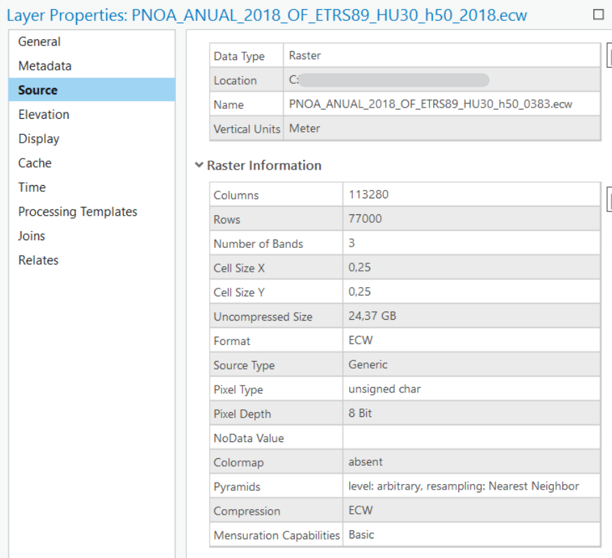

# Modelos pre-entrenados

Lo ideal es tener tiempo y recursos para entrenar tus propios modelos porque será cuando se llegue a la mejor conclusión pero no es real, muchas veces tendremos que utilizar modelos pre-entrenados por otras personas. Un sitio del que podemos obtener modelos pre-entrenados es el Living Atlas donde hay más de [70 dlpks](https://livingatlas.arcgis.com/en/browse/?q=dlpk#q=dlpk&d=2) compartidos de distintas temáticas.

Para poder utilizar un modelo preentrenado debemos cumplir algunos requisitos como el tipo de dato de entrada y si es una imagen, su resolución. 

Por ejemplo, en el modelo [clasificación de cobertura del suelo](https://www.arcgis.com/home/item.html?id=afd124844ba84da69c2c533d4af10a58) podemos ver como se necesita una imagen ráster con una resolución de 10 metros.


Podemos ver las características de la imagen con la que vamos a trabajar en:
1. **ArcGIS Online** viendo el detalle del elemento donde está alojada la imagen.


2. En **ArcGIS Pro** en las propiedades del elemento podemos ver el cell size así como el número de bandas de la imagen. 



Puede que un modelo pre-entrenado no nos valga porque esté entrenado con datos concretos y no sea aplicable en nuestros datos. Por ejemplo, es un modelo de detección de piscinas cuadradas y nosotros tenemos piscinas redondas. Para solucionar esto tenemos dos alternativas: entrenar un modelo desde cero o reentrenar un modelo.

## Entrenamiento de un modelo

El elemento esencial para entrenar un modelo son los datos porque a partir de ellos podremos usar la función [*prepare_data*](https://developers.arcgis.com/python/api-reference/arcgis.learn.toc.html#prepare_data) que nos devolverá un objeto *data* que contendrá un conjunto de datos de entrenamiento y de validación con información sobre la transformación, tamaño del chip, etc. 

Una vez que tenemos los datos, tendremos que cargar la **arquitectura del modelo** que mejor se adapte al tipo de algoritmo que queremos aplicar. Para la definición de esos modelos tendremos que pasarle como parámetros esos datos que acabamos de preparar. 

Cuando tengamos definido el modelo solo hay que entrenarlo para lo cual tendremos que encontrar su tasa de aprendizaje y lanzar unas cuantas *epochs* 
> Este número será más alto que si estuviésemos re-entrenado el modelo y es por eso que se dice que siempre es mejor re-entrenar un modelo que hacerlo desde cero ya que se necesitan muchos más recursos. 

## Re-entrenamiento de modelos

Si utilizamos un modelo pre-entrenado pero este no se ajusta bien a nuestro conjunto de dato podemos mejorar el ajuste del modelo con nuestros datos. Este proceso será mucho más rápido que entrenar un modelo desde cero y para ello seguiremos tres pasos:
1. Cargar datos de entrenamiento
2. Afinar el modelo pre-entrenado
3. Desplegar el modelo

### Cargar datos de entrenamiento

Prepararemos los datos con la función *prepare_data* a la que le pasaremos el path de nuestros datos. 

```python
from arcgis.gis import GIS
gis = GIS('home')
portal = GIS('https://pythonapi.playground.esri.com/portal')

training_data = gis.content.get('5351aca735604197ac8d8ede45f6cc4b')
training_data

filepath = training_data.download(file_name=training_data.name)

import zipfile
from pathlib import Path
with zipfile.ZipFile(filepath, 'r') as zip_ref:
    zip_ref.extractall(Path(filepath).parent)

data_path = Path(filepath).parent / 'building_footprints'

from arcgis.learn import prepare_data
data = prepare_data(data_path, 
                    batch_size=16, 
                    chip_size=400)


# Viaualizar datos de entrenamiento
data.show_batch(rows=4)
```

### Ajuste del modelo

De la página de Living Atlas podemos descargar el modelo a través de su identificador. 
```python
model_item = gis.content.get('a6857359a1cd44839781a4f113cd5934')
model_item

model_path = model_item.download(file_name=model_item.name)
```

Una vez descargado el modelo, podemos cargarlo con la función *from_model*
```python
from arcgis.learn import MaskRCNN
model = MaskRCNN.from_model(model_path, data)
```

A continuación, lo lógico sería probar el modelo tal cual con nuestros datos. 
```python
model.show_results()
```

También podemos obtener la **tasa de aprendizaje** que es uno de los hiper parámetros más importantes en el entrenamiento de modelos. El método *lr_find()* encuentra la tasa de aprendizaje óptima que nos permite ajustar el modelo. 
```python
lr = model.lr_find()
```

### Entrenamiento del modelo
Una vez que tenemos la tasa de aprendizaje, podemo usarla para entrenar el modelo.
```python
model.fit(10, lr=lr)
```

Así hemos **reentrenado el modelo** y por ello, si mostramos de nuevo el resultado, veremos que se ajusta mejor a nuestros datos.
```python
model.show_results()
```

### Guardar el modelo
Una vez que tenemos el modelo reentrenado y que se ajuste mejor a nuestros datos, tan solo tendremos que guardar el modelo:
```python
model.save("New_building_footprint")
```